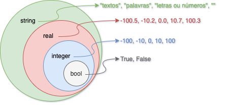

# Curso lógica de programação com python

Repositório contendo todo o material do primeiro modulo das aulas de lógica de programação com python.

## Aula 0
[aula0/](aula0/)

- Apresentação do curso, qual o objetivo, definição da nossa dinâmica e alinhamento das nossas expectativas.
- Apresentação do Python.
- Variáveis e alguns tipos de variável (`string`, `integer` e `double`).
- Como mostrar os valores das variáveis.

## Aula 1
[aula1/](aula1/)

- Tipo de variável `bool`.
- Operadores lógicos `AND`(e) e `OR`(ou).
- Tabela verdade do operador lógico `AND`.
- Tabela verdade do operador lógico `OR`.

## Aula 2
[aula2/](aula2/)

- Operador lógico `NOT`(negação).
- Utilização do operador lógico `NOT` com os operadores `AND` e `OR`.
- Cláusula condicional `IF`.

## Aula 3
[aula3/](aula3/)

- Entrada de dados utilizando a função `input()`
- Cláusula condicional `IF` e `ELSE`.
- Valor padrão para uma variável.

## Aula 4
[aula4/](aula4/)

- Revisão.
- Cláusula condicional `ELIF`.
- Método chinês para debuparação manual do código.

## Aula 5
[aula5/](aula5/)

- Formatação de string (`%s` e `%f`).
- Arredondamento de números reais (`float`).
- Cast: conversão de uma `string` em um `float`.
- Implementação do primeiro programa. Conversor simples de moedas (Real R$, Dólar U$ e Euro €).

## Glossário

| Termo         | Definição |
| ------------- | --------- |
| Atribuição    | Ato de alterar o valor de uma variável. |
| IDE           | _*I*ntegrated *D*evelopment *E*nvironment_. Ambiente de desenvolvimento integrado, é um software que combina ferramentas comuns de desenvolvimento em um único local, facilitando o desenvolvimento de aplicações. |
| Interpretador | São programas de computador que leem um código fonte de uma linguagem de programação interpretada e o converte em código executável. |
| Terminal      | É um programa de computador, no qual digitamos comandos para dar instruções para o computador e visualizar informações dessa máquina. Ele serve para você executar tarefas no computador sem utilizar a interface gráfica, com pastinhas e ícones, ou o bom e velho mouse. No Windows temos o `PowerShell` ou `CMD`, no Linux temos o `bash` e no MacOS temos o `terminal`.
| Variável      | É um objeto (uma posição, frequentemente localizada na memória) capaz de reter e representar um valor ou expressão. |

## Tabela verdade dos operadores

Confira um resumo da tabela verdade dos operadores `AND`, `OR`, `NOT` e muito mais clicando [aqui](tabela_verdade_operadores.md)

## Tipagem das variáveis



-    bool: Corresponde aos valores 'verdadeiro' ou 'falso', 'sim' ou 'não'.
- integer: Corresponde ao conjunto dos números inteiros.
-    real: Corresponde ao conjunto dos números reais.
-  string: Corresponde a um ou mais caracteres, podendo ser letras, números ou símbolos.

Representação dos tipos no Python:

```Python
    bool: bool
 inteiro: int
    real: float
  string: str
```

Valores padrões dos tipos:

```Python
 bool: False
  int: 0
float: 0.0
  str: "" ou ''
```
